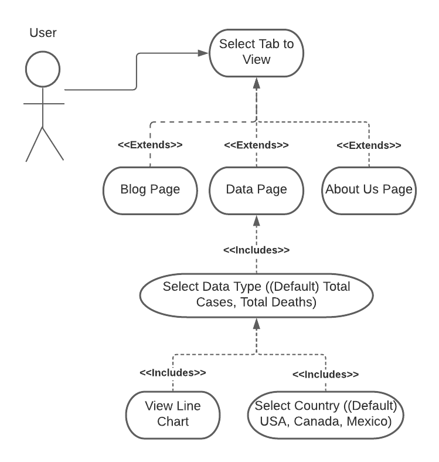

# DataTitans

## Description of Prototype
1. From home page, user can navigate to data, about, and blog pages. User can also navigate to each of these pages from one other using a menu bar near top of page
2. The data page will allow users to choose from drop down lists of countries (USA-default, Canada, Mexico), data types (total cases-default, total deaths) and chart types (line)
3. The charts will show the selected data for all dates in the COVID-19 data from Our World in Data as of the latest download
4. The about page will show a brief description of the website as well as short bios of the team members
5. User can view blog page to read about future of the site. The initial blog post will include specifications for the completed project
6. Charts are built with downloaded CSV file integrated to SQLite database with visualization through seaborn library. If csv is updated, website reflects updates
7. Remaining web elements are built with HTML
8. The charts and data should be accessible by the latest browsers, i.e Firefox, Chrome, Safari.

## Use Case Diagram

## Getting Started

In order to set up and run the project you will need to have [Python 3.8](https://www.python.org/downloads/) and [Django 3.1.1](https://www.djangoproject.com/download/) or later installed.

### Installing Python
You can either install python directly on your machine or use a python engine such as [Anaconda](https://www.anaconda.com/products/individual).
It is advised to run Python inside a virtual environment.

### Installing Django
1. Run `python -m pip install --upgrade pip`
2. Run `pip install -r requirements.txt`. This will install the required packages.

### Running Migrations
To ensure that all members' database is up to date and avoid migration errors, run the following command whenever a change has been made to the database. Or to be safer, whenver you pull a new version of the project from github.

1. Run `python manage.py makemigrations`
2. Run `python manage.py migrate`

## Running the Web Server
1. Inside the datatitans directory, where `manage.py` is, run `python manage.py migrate`. This sets up the database. (Currently SQLite)
2. Run `python manage.py runserver`

## Adding blog posts
1. Run web server
2. Enter this in the url `127.0.0.1/admin`
3. Enter the user name and password. ( can be found on the datatitans shared drive folder)
4. On the admin page click the +Add button next to Posts 

5. Add Author, title and text of the blog.

6. You can save and continue later (do not fill out publish date info or choose a future date), and when ready to publish just click the now and today buttons under the 'Publish date' form item
